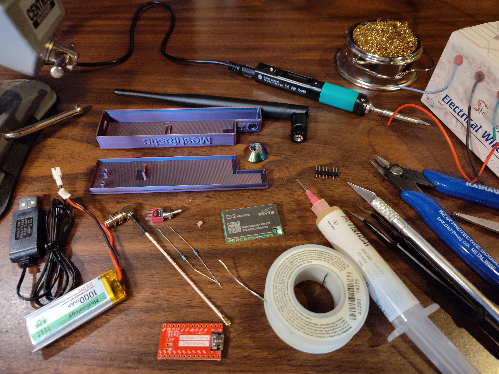
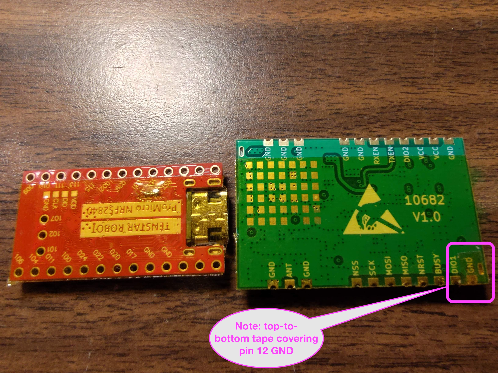
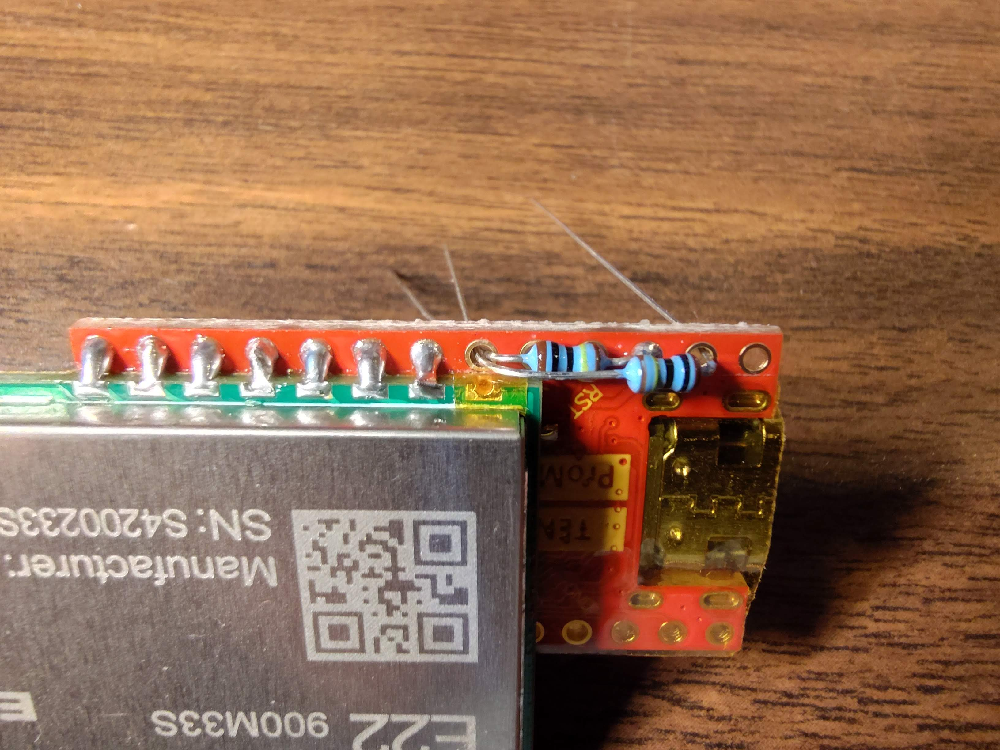
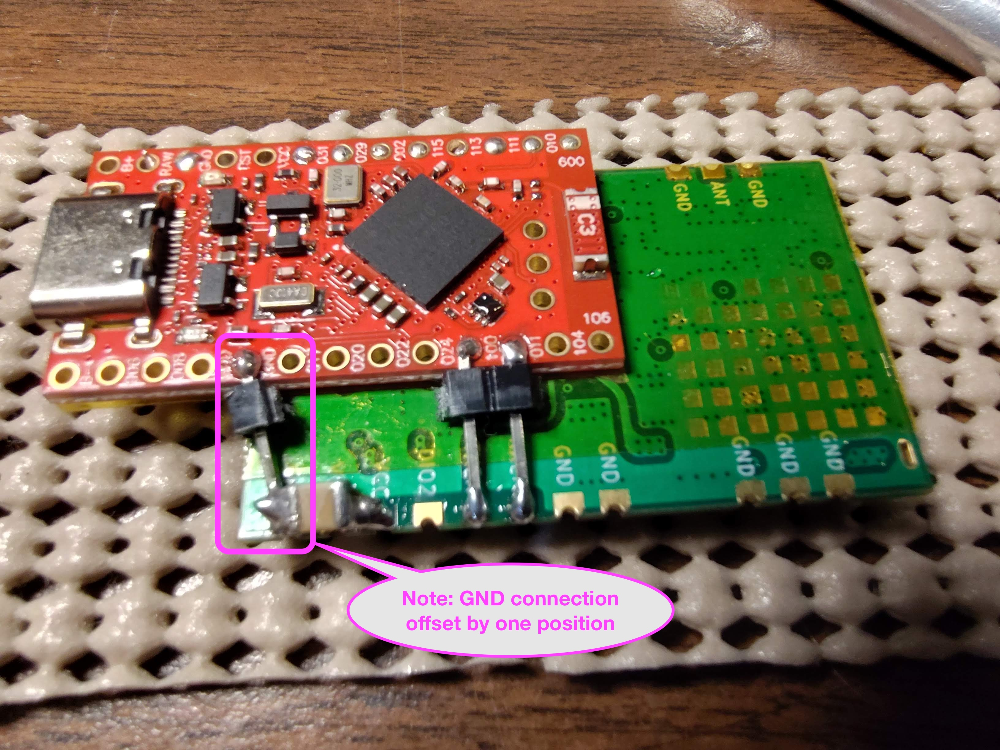

# Easy DIY E22 NRF52840 Build Instructions #

This project provides build instructions and 3D print files for a
basic but powerful DIY Meshtastic node with the following features:

- Pocket sized
- Battery powered, 40+ hour run time
- ~1 watt maximum output on internal battery power
- ~2 watt maximum output on USB power
- Based on two easy-to-obtain COTS modules
- Relatively easy assembly and soldering with no custom PCB required

The castellated edge connections on the E22 module, along with the pin
assignment flexibility of the NRF52 MCU, allow most signals to pass
between boards with no wiring.  Just careful positioning, a little
solder, and three header pins connect all signals.  Point-to-point
wiring is used only for battery power.

The E22 gives this node outstanding performance in a compact package.
The hinged and swiveling antenna matches the physical design of the
node, shielding the battery power switch from accidental bumps.  This
node works well when folded, yet makes no compromises when
straightened up at your destination.

## Target audience

These instructions assume you have basic electronics soldering
equipment, supplies and tools, and are reasonably competent at
soldering surface mount and thru-hole PCBs.  If you have no experience
soldering, don't give up; you can probably learn to solder in a few
hours.  There are plenty of tutorial videos out there.  But don't do
your early practice on this project.

Similarly, it's best if you are familiar with other Meshtastic nodes
as this is not an introduction to Meshtastic.

## Parts list:

Note: Product links are examples of components with the required
specifications and do not imply a recommendation of a specific part or
supplier.

These are not affiliate links.

- "Pro Micro compatible" NRF52840 dev module

    Such as the [Teyleten](https://www.amazon.com/dp/B0CYLNZ6V4), [Tenstar Robot](https://www.aliexpress.us/item/3256807958420169.html) or [Nice!Nano](https://www.aliexpress.us/item/3256805975015643.html).
    Some of these can be found for less than $3 each.

- Ebyte E22 900M33S LoRa module

    Usually $15-20, available from [Amazon](https://www.amazon.com/868MHz-Wireless-E22-900M33S-Distance-Transceiver/dp/B0CZNHX91T) or [AliExpress](https://www.aliexpress.us/item/3256806595412116.html).
    
- 1000mAh LiPo cell with protection board

    The 50mm x 20mm x 10mm cells from
    [Amazon](https://www.amazon.com/dp/B0F1FM58ZW) or [AliExpress](https://www.aliexpress.us/item/3256802548578153.html) fit this case design.

    Smaller cells can still provide useful battery life, but be sure
    they are capable of over 1 amp output without significant voltage
    drop.  Higher C cells will produce slightly higher RF output.
    Larger cells will require a larger case.  You may also want a
    matching JST PH 2.0 socket like this one from
    [AliExpress](https://www.aliexpress.us/item/3256802377876396.html).

- Mini micro 3-pin SPDT toggle switch

    The battery switch needs to be smaller than is common; I used
    this one from
    [Amazon](https://www.amazon.com/dp/B075RDYMQQ) which is 8.2mm x 5.1mm
    and just fits.

- 915/868 MHz Antenna

    A high-quality hinged dipole fits and works well.
    
    Unfortunately, three out of three different brands I purchased
    from Amazon did not come close to high quality, and two of the
    three seemed to be less efficient multi-band antennas.
    
    The one that came with my Station G2 was close, needing only a
    slightly longer element to bring the resonant frequency down a bit
    from ~960 MHz.  The result looks very good now on the VNA.
    
    The ALFA Network ARS-915PR I ordered from
    [ROKLAND](https://store.rokland.com/collections/802-11ah-wi-fi-halow/products/alfa-network-ars-915pr-2-dbi-helium-miner-hotspot-replacement-antenna-with-90-elbow-for-rak-bobcat-sensecap-m1)
    appears well tuned on my VNA.

    When choosing antennas, be aware of the difference between SMA and
    RP-SMA.  It is, unfortunately, possible to attach an RP-SMA
    antenna to an SMA jack, but there will be no electrical connection,
    and you may damage the E22.  Always make sure you see a pin on
    one end or the other when connecting.

- SMA female right-angle Pigtail

    Like these from [Amazon](https://www.amazon.com/dp/B0F8VSNWRN) or [AliExpress](https://www.aliexpress.us/item/3256803637335358.html)
    
- Wire

    22-24 AWG stranded Silicone wire is recommended to reduce voltage
    drop and keep RF power output up to spec.

- Two battery sensing voltage divider resistors

    Almost any pair of the same value, axial-lead resistors will work to
    divide the battery voltage in half so that it can be measured
    safely by the ADC.
    10K - 1M ohm is recommended, as lower values may impact battery life.
    1/4 - 1/8 watt will work, but 1/8 watt is easier to fit.
    1% recommended, but up to 10% will work.
    You may need to adjust the ADC multiplier override ratio for
    accurate battery voltage readings, especially if you don't use 1%
    tolerance or choose a high higher resistance than recommended.

- Common 2.54 mm pin header

    These usually come with the NRF52840 board.
    
- Heat-resistant insulating tape

    Every workbench should have a roll of this 
    [Stuff](https://www.amazon.com/ELEGOO-Polyimide-Temperature-Resistant-Multi-Sized/dp/B072Z92QZ2).
    Often called Kapton tape.

## E22 connections to NRF52 module

| E22 Pin Number | E22 Signal | NRF52 Pin | Method        |
| -------------- | ---------- | --------- | ------------- |
| 12             | GND        | N/C       | No connection |
| 13             | DIO1       | P0.29     | Direct solder |
| 14             | BUSY       | P0.02     | Direct solder |
| 15             | NRST       | P1.15     | Direct solder |
| 16             | MISO       | P1.13     | Direct solder |
| 17             | MOSI       | P1.11     | Direct solder |
| 18             | SCK        | P1.10     | Direct solder |
| 19             | NSS        | P1.09     | Direct solder |
|                |            |           |               |
| 11             | GND        | GND       | Header pin    |
| 10             | VCC        | B+        | Wire          |
|                |            |           |               |
| 7              | TXEN       | P1.00     | Header pin    |
| 6              | RXEN       | P0.11     | Header pin    |

## Battery sense voltage divider connections

| NRF52 Pin | Battery sense voltage divider |
| --------- | ----------------------------- |
| P0.31     | R1 + R2                       |
| B+        | R1                            |
| GND       | R2                            |

## Power wiring

| Source            | Function         | Destination           |
| ----------------- | ---------------- | --------------------- |
| NRF52 pin B+      | Battery positive | Battery switch common |
| NRF52 pin GND     | Ground           | Battery negative      |
| NRF52 5V USB      | 5 volts          | Battery switch off    |
| Battery switch on | Battery          | Battery positive      |

## NRF52 module optional feature pin mappings

| Pin   | Function    |
| ----- | ----------- |
| P0.06 | Serial2 RX  |
| P0.08 | Serial2 TX  |
|       |             |
| P1.04 | SDA         |
| P1.06 | SCL         |
|       |             |
| P1.01 | GPS_TX      |
| P1.02 | GPS_RX      |
| P1.07 | GPS_EN      |

## Build procedure

Instead of a custom PCB, the castellated edge of the E22 module
is soldered on the insulated back of the NRF52 module.
Temporary gluing, taping, or
gentle clamping (use a small vise with rubber bumpers) will help
with soldering.
Construction time may be 2-4 hours.

When soldering the castellated edge, be sure *not* to solder
pin 12 of the E22 module.
It's an unused ground, and the corresponding pad of the NRF52 module
will be used for the battery sense voltage divider.

Strip and tin each wire before soldering it in place.

### 1. 3D print or obtain a case

The OpenSCAD source and STL files are included here.  If you don't
have a 3D printer or a friend with one, some public libraries have
one.  There are also companies that sell this service.

PLA works fine.  Use your highest quality settings.  Supports should
not be required.  Test fit the cover after printing.  It should snap
on tightly.

### 2. Flash firmware

Be sure to perform the initial flash of the firmware on the NRF board
before proceeding with the assembly, so that the debug pads on the
bottom of the board will be available in case anything goes wrong.
This also ensures that the TXEN pad is not driven when it shouldn't be,
which could damage the E22.

Follow the Meshtastic instructions to upgrade to the
[Adafruit bootloader](https://github.com/adafruit/Adafruit_nRF52_Bootloader) using
[Method 1: UF2](https://meshtastic.org/docs/getting-started/flashing-firmware/nrf52/update-nrf52-bootloader/#method-1-using-the-uf2-file-recommended).
Download and install the
[latest version](https://github.com/adafruit/Adafruit_nRF52_Bootloader/releases/latest)
of the update nice nano bootloader,
e.g., `update-nice_nano_bootloader-0.9.2_nosd.uf2`.

Note that since there is no reset
button, you need to carefully and briefly short the RST and GND pads
twice within 1/2 second to activate bootloader mode.  Be sure you short
only the correct pins, 3rd and 4th from the end.
Small tweezers work well.
It may take a few tries; look for the slow "breathing"
red LED to show success.

Once the bootloader is installed, you can use the same method to
install the Meshtastic firmware.  Note, this node is not yet supported
in the Meshtastic firmware source, so I have provided a development
[firmware binary](firmware.uf2).  The source is
[here](https://github.com/brad112358/meshtastic_firmware/tree/easy_promicro_e22).

After everything is flashed, plug just the NRF board into USB power
and verify you can pair and connect to it with the Meshtastic app.

### 3. Set battery charge current

If you will connect a battery larger than about 500 mAh, you probably
want to short the two square "BOOST" pads on the back of the board
near the RST and VCC pads to reduce charge time; Solder stripped
wire-wrap wire, or separate a couple of coarse wire strands, or just
bridge the pads with solder, keeping it as thin as you can.

### 4. Insulate boards

A layer or two of polyimide or other high-temperature tape between the
boards is recommended to avoid any chance of shorting exposed vias.
Leave the E22 pads on the edge with VCC exposed, but cover the back
surface of the pads on the other edge.

Cover the
entire pin 12 GND pad next to DI01 on the E22 to avoid any chance of shorts
when the resistors are later installed.

### 5. Align and very gently clamp boards

After applying and trimming the heat-resistant tape, position the
boards back to back, such that pads
P0.09-P0.29 on the Pro Micro NRF52840 line up with
pads NSS-DI01 (pins 19-13) on the E22. Align the boards carefully such that
last eight pads on each board are directly opposite, but not quite touching.

> ⚠️ **Warning:** Only seven of the eight aligned pads will be bridged,
so the NRF board should overhang the E22 enough that you can
see the entirety of each pad on the bottom of the NRF board.

Hold, very gently clamp, temporarily tape, or glue the boards in this position.

If you position the boards carefully, with ~.1mm gap between the inner
edges of the pads on the NRF and the castellated edge of the E22, you can
make the connections with solder bridges and still easily unsolder them to
separate the boards later in case you brick it and need to access the
programming pads on the bottom.

### 6. Solder first edge connections

Start by soldering the two connections on each end, 009 to NSS and 029
to DI01.  Solder from the NRF board bottom pad to the edge of the
corresponding castellated E22 pad.  Before proceeding to solder the 5
remaining connections on this edge of the boards, check that the
spacing is correct and that each connection is correct as in the table
above.

### 7. Install voltage divider resistors

For battery-powered builds, you will want a voltage divider to sense
the battery voltage.  Solder a resistor between P0.31 and B+ or RAW
and an identical resistor between P0.31 and GND on either side of the
board.

### 8. Optional capacitor

To reduce power supply noise, you can also solder a ceramic SMD
capacitor between the VCC and GND pads on the E22.

### 9. Solder second edge connections

On the other edge of the boards, solder short solid conductors from
RXEN to P0.11, from TXEN to P1.00, and from GND to GND.  Notice the
GND connection is offset by one position so it will be at a slight
angle relative to the other pins which are straight across.
Insulation is not needed here, but the use of trimmed header pins is
recommended if you didn't permanently affix the boards with glue.  The
rigid pins help hold the boards together and reduce the chance of
breaking solder connections on the first edge.

### 10. Solder power wire

Lastly, we need to power the E22; Solder a short length of insulated wire from
VCC on the E22 to the B+ or RAW pad.

> ⚠️ **Warning:** Never power up the E22 without an antenna or 50-ohm load
connected, or it may be damaged.  And never set SX126X_MAX_POWER define
to more than 8 when building firmware for the E22 900M33S, or it will
be damaged.

### 11. Check work

Use a continuity tester to carefully check each soldered connection
and also check for any unintended shorts between adjacent pads.

### 12. Wire battery switch

Clip the longer middle terminal of the battery switch so it is a bit shorter than
the other two terminals, and test fit it in the case. You probably need to trim
the other terminals a bit as well.

Solder wires to the two farthest terminals, closest to the SMA.

### 13. Install SMA pigtail

Use a nut or a few washers inside the case to adjust the exposed length of the SMA jack so
that the antenna fits properly.  Tighten the nut snugly while holding
the jack so the pigtail touches the bottom of the case where it
connects to the SMA jack to allow room for the battery switch.  Test fit the
antenna;  it should get tight just before it reaches the nut.  If it
contacts the nut first, adjust the inside spacing.

Carefully connect the pigtail U.FL to the E22, and be careful not to
pull or twist it off during the remainder of the assembly.

### 14. Connect Antenna or 50-ohm load

Never power up the E22 or connect the USB without an antenna or load
connected or it may be damaged.

### 15. Connect battery switch and battery wires

As you make the remaining connections, place the boards and battery switch in
position and trim wires close to the required length so they will fit
neatly in the case.

Solder the wire on the battery switch terminal closest to the SMA to
one of the LDO terminals, which are connected to the USB VBUS pads
(You can leave this off if you don't want the option of higher power.)
Unfortunately, USB power is not connected to a pad on this board.
But, it is easy to use a continuity tester to find a convenient LDO
pin that connects to the USB power pins.  The USB VBUS pads are the larger
pads second from either end of the USB connector.

Move the battery switch toggle to the off position, closest to the case.

Connect the wire from the middle battery switch terminal to the B+ or raw pad,
or to the VCC pads of the E22.

If you don't have a jack to fit the battery connector, and you don't
need the battery charger that may have come with the battery, you can
use its jack and wire for the battery connection.  Or, you may
carefully solder the battery lead directly if you don't want the
battery to be removable.

Connect the remaining (closest) battery switch terminal to the positive (red) battery lead
or the correct battery jack wire.

### 16. Install battery switch

Tighten the battery switch nut snugly while preventing the switch from
rotating.

The off position of the battery switch is towards the case, and the on position
is towards the SMA jack.  Note, however, that the node will also be
powered on when the switch is off if USB power is connected.

### 17. Install battery

Check that the battery switch is in the off position and that the antenna and
U.FL are still connected.

Solder the negative (black) lead of the battery or jack wire to a GND
pad.

If you used a connector for the battery, connect it.
Arrange wires and place the battery in the case.

### 18. Assemble case

If you haven't already, slide the board assembly fully into place in
with the USB connector level and inserted into the USB hole.
Then, gently press the boards down to seat the edge of the E22 RF
shield against the wall in the middle of the case so it can't slide
away from the USB hole.  If the USB connector won't fit the hole
because of filament sag, carefully trim to fit.

Carefully install the case lid, taking care not to pinch wires.  You
may want to use some heat-resistant tape to keep the longer wires in
place at the side of the case, away from the protruding parts of the
lid.

## Usage notes:

If built as described here, this node can be powered by either USB or
the internal 1 S Lithium battery.

When the battery switch is on (towards the SMA jack), the battery is
connected to both the battery terminal of the NRF board and VCC of the
E22.  If the USB port is plugged in when the battery switch is on, the onboard
charger will charge the 1000 mAh battery in about 3 hours, assuming
you shorted the square pads as suggested.

When the battery switch is off (towards the case), the battery is
completely disconnected, and the USB voltage is connected to the B+ pad
and VCC of the E22.  This means that the battery will not charge with
the switch off, and that the node will operate only from USB power.

| Battery Switch | USB Power     | Node On | Charging | TX Power |
| -------------- | ------------- | ------- | -------- | -------- |
| On             | Connected     | ✅      | ✅       | ~1 watt  |
| Off            | Connected     | ✅      | ❌       | ~2 watts |
| On             | Not connected | ✅      | ❌       | ~1 watt  |
| Off            | Not connected | ❌      | ❌       | none     |

> ⚠️ **Warning:** The antenna MUST be connected anytime
USB power is connected or the battery switch is on, including when charging, to
avoid damaging the E22 module.

When the antenna is installed, it
helps protect the battery switch from being inadvertently changed.  The 3D
design files include an optional safety device which, when screwed
onto the SMA jack, will prevent the battery switch from accidentally
being turned on. Use this in case you wish to carry the node with the
antenna detached.  If you really must charge the battery without an
antenna connected, connect a 50-ohm load.

When operating on battery power, the voltage supplied to the E22
module is between 4.2 and 3.0 volts, and for most of that range, it will
output a maximum of about 1 watt.

When operating on 5-volt USB power with the battery switch off, the E22 is
capable of about 2 watts of output power.  The Meshtastic firmware
variant `diy/easy-nrf-pro-micro_e22` is configured to expect battery
voltage, thus, when powered via 5-volt USB, configuring the node for 30 dBm
(1 watt) output should produce about 33 dBm (2 watts).

Because they are designed for higher current applications, many cheap
battery protection boards are set to cut off at less than the safe
minimum of 3.0 volts.  To avoid damaging your battery or reducing its
service life, it is recommended to monitor the battery voltage and
turn off or charge your node before the battery is exhausted.

When charging, the blue LED will remain lit until the battery is about
80% charged. Then it will cycle on and off at various intervals until
fully charged.

When running from battery power, the red LED will periodically flash
very briefly and will flash longer when transmitting.  When running
from USB power, the red LED will flash every 2 seconds.

## Acknowledgments:

A big thank-you to Bob Van Valzah for testing the node and reviewing
and improving this document!
