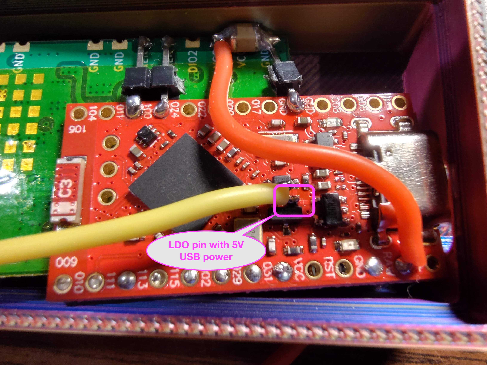

# Easy DIY E22 NRF52840 build instructions #

This project provides build instructions and 3D print files for a
basic but powerful DIY Meshtastic node with the following features:

- Pocket sized
- Battery powered, 40+ hour run time
- ~1 watt maximum output on internal battery power
- ~2 watt maximum output on USB power
- Based on 2 easy to obtain COTS modules
- Relatively easy assembly and soldering with no custom PCB required

## Target audience

These instructions assume you have basic electronics soldering
equipment, supplies and tools, and are reasonably competent at
soldering surface mount and thru-hole PCBs.  If you have no experience
soldering, don't give up; you can probably learn to solder in a day or
two.  There are plenty of tutorial videos out there.  But, don't do
your early practice on this project.

Similarly, it's best if you are familiar with other Meshtastic nodes
as this is not an introduction to Meshtastic.

## Parts list:

Note: Product links are examples and do not imply strong recommendation.

- Low cost "Pro Micro compatible" NRF52840 dev module

    Such as the Teyleten, Tenstar Robot or Nice Nano.
    These can be found for less than $3 each.

- Ebyte E22 900M33S LoRa module

    Usually $15-20, available from [Amazon](https://www.amazon.com/868MHz-Wireless-E22-900M33S-Distance-Transceiver/dp/B0CZNHX91T) or [AliExpress](https://www.aliexpress.us/item/3256806595412116.html).
    
- 1000mAh LiPo cell with protection board

    The 50mm x 20mm x 10mm cells from
    [Amazon](https://www.amazon.com/dp/B0F1FM58ZW) or [AliExpress](https://www.aliexpress.us/item/3256802548578153.html) fit this case design.

    Smaller cells can still provide useful battery life, but be sure they
    are capable of over 1 amp output.  Larger cells will require a
    larger case.  You may also want a matching JST PH 2.0 [socket](https://www.aliexpress.us/item/3256802377876396.html).

- Mini micro 3 pin SPDT toggle switch

    The switch needs to be smaller than is common, I used
    [this one](https://www.amazon.com/dp/B075RDYMQQ) which is 8.2mm x 5.1mm
    and just fits.

- 915/868 MHz Antenna

    A high quality hinged dipole fits and works well.

    When choosing antennas, be aware of the difference between SMA and
    RP-SMA.  It is, unfortunately, possible to attach an RP-SMA
    antenna to an SMA jack, but there will be no electrical connection
    and you will damage the E22.  Always make sure you see a pin on
    one or the other when connecting.

- SMA female right angle Pigtail

    Like these from [Amazon](https://www.amazon.com/dp/B0F8VSNWRN) or [AliExpress](https://www.aliexpress.us/item/3256803637335358.html)
    
- Wire

    24-28 AWG stranded Silicone wire is recommended.

- 2 1/8 Watt 1M ohm resistors with leads

- Common 2.54 mm pin header

    These usually come with the NRF52840 board.
    
- Heat resistant tape

    Every workbench should have a roll of this [stuff](https://www.amazon.com/ELEGOO-Polyimide-Temperature-Resistant-Multi-Sized/dp/B072Z92QZ2).

## E22/NRF52 PRO MICRO PIN ASSIGNMENT

| Pin   | Function    |     | Pin      | Function     |
| ----- | ----------- | --- | -------- | ------------ |
| Gnd   |             |     | vbat     |              |
| P0.06 | Serial2 RX  |     | vbat     |              |
| P0.08 | Serial2 TX  |     | Gnd      |              |
| Gnd   |             |     | reset    |              |
| Gnd   | GND         |     | ext_vcc  | *see 0.13    |
| P0.17 | Free pin    |     | P0.31    | BATTERY_PIN  |
| P0.20 | Free pin    |     | P0.29    | DI01         |
| P0.22 | Free pin    |     | P0.02    | BUSY         |
| P0.24 | Free pin    |     | P1.15    | NRST         |
| P1.00 | TXEN        |     | P1.13    | MISO         |
| P0.11 | RXEN        |     | P1.11    | MOSI         |
| P1.04 | SDA         |     | P0.10    | SCK          |
| P1.06 | SCL         |     | P0.09    | NSS          |
|       |             |     |          |              |
|       | Mid board   |     |          | Internal     |
| P1.01 | GPS_TX      |     | 0.15     | LED          |
| P1.02 | GPS_RX      |     | 0.13     | 3V3_EN       |
| P1.07 | GPS_EN      |     |          |              |

## Build procedure

This node is constructed primarily by temporarily gluing, taping or
gently clamping (use a small vise with rubber bumpers), and then
soldering, the NRF development board directly to an EBYTE E22 900m30S.
Construction time may be 2-4 hours.

Strip and tin each wire before soldering in place.

### 1. 3D print or obtain case

The OpenSCAD source and STL files are included here.  If you don't
have a 3D printer or a friend with one, some public libraries have
one.  There are also companies which sell this service.

PLA works fine.  Use your highest quality settings.  Supports should
not be required.  Test fit the cover after printing.  It should snap
on tightly.

### 2. Flash firmware

Be sure to perform the initial flash of the firmware on the NRF board
before proceeding with the assembly so that the debug pads on the
bottom of the board will be available in case anything goes wrong.
This also ensures that the TXEN pad is not driven when it shouldn't be
which could damage the E22.

Follow the Meshtastic instructions to upgrade to the
[Adafruit bootloader](https://github.com/adafruit/Adafruit_nRF52_Bootloader?tab=readme-ov-file#adafruit-nrf52-bootloader) using
[Method 1: UFL](https://meshtastic.org/docs/getting-started/flashing-firmware/nrf52/update-nrf52-bootloader/#method-1-using-the-uf2-file-recommended).
Download and install the
[latest version](https://github.com/adafruit/Adafruit_nRF52_Bootloader/releases/latest)
of the [nice nano .uf2 file](https://github.com/adafruit/Adafruit_nRF52_Bootloader/releases/download/0.9.2/update-nice_nano_bootloader-0.9.2_nosd.uf2).
Note that since there is no reset button, you need to carefully and briefly
short the RST and GND pads twice in 1/2 second to activate bootloader
mode.  Be sure you short only the correct pins, 3rd and 4th from the end.  A
small tweezers works well.  It may take a few tries; look for the slow "breathing" red LED.

Once the bootloader is installed, you can use the same method to
install the Meshtastic firmware.  Note, this node is not yet supported
in the Meshtastic firmware source, so I have provided a development
[firmware binary](firmware.uf2).  The source is
[here](https://github.com/brad112358/meshtastic_firmware/tree/easy_promicro_e22).

### 3. Set battery charge current

If you will connect a battery larger than about 500 mAh, you probably
want to short the two square "BOOST" pads on the back of the board
near the RST and VCC pads to reduce charge time; Solder stripped
wire-wrap wire, or separate a couple of coarse wire strands, or just
bridge the pads with solder, keeping it as thin as you can.

### 4. Insulate boards

A layer or two of polyimide or other high temperature tape between the
boards is recommended to avoid any chance of shorting exposed vias.
Leave the E22 pads on the edge with VCC exposed, but cover the back
surface of the pads on the other edge.  You might want to cover the
entire GND pad next to DI01 on the E22 to avoid any chance of shorts
when the resistors are later installed.

### 5. Align and very gently clamp boards

After applying and trimming the heat resistant tape, position the
boards back to back such that the 7 pads at the antenna end,
P0.09-P0.29 pads on the edge of the Pro Micro NRF52840 line up with
the NSS-DI01 pads on the E22.  Align the boards carefully such that
the pads on each board are directly opposite the corresponding pads on
the other board.  To allow the possibility of separating the boards
later, the NRF board should overhanging the E22 enough that you can
see the entirety of each pad on the bottom of the NRF board.  Hold,
very gently clamp, temporarily tape, or glue the boards in this position.

If you position the boards carefully, with ~.1mm gap between the inner
edges of the pads on the NRF and the outer edge of the E22, you can
make the connections with solder bridges and still easily unsolder to
separate the boards later in case you brick it and need to access the
programming pads on the bottom.

### 6. Solder first edge connections

Start by soldering the two connections on each end, 009 to NSS and 029
to DI01.  Solder from the NRF board bottom pad to the edge of the
corresponding castellated E22 pad.  Before proceeding to solder the 5
remaining connections on this edge of the boards, check that the
spacing is correct and that each connection is correct as in the table
and #defines below.

### 7. Install voltage divider resistors

For battery powered builds, you will also want a voltage divider to
sense the battery voltage.  Solder a 1/8 Watt 1M Ohm resistor between
P0.31 and B+ or RAW and an identical resistor between P0.31 and GND on
either side of the board.  Somewhat smaller or larger resistor values will work,
but VBAT_DIVIDER_COMP will need to be adjusted slightly to account for
the effect of the input current drain.

### 8. Optional capacitor

To reduce power supply noise, you can also solder a ceramic SMD
capacitor between the VCC and GND pads on the E22.

### 9. Solder second edge connections

On the other edge of the boards, solder short solid conductors from
RXEN to P0.11, from TXEN to P1.00, and from GND to GND.  Notice the
GND connection is offset by one position.  Insulation is not needed
here, but the use of trimmed header pins is recommended if you didn't
permanently affix the boards with glue.  The rigid pins help hold the
boards together and reduce the chance of breaking solder connections
on the first edge.

### 10. Solder power wire

Lastly, we need to power the E22; Solder a short length of insulated wire from
VCC on the E22 to the B+ or RAW pad.

Warning: Never power up the E22 without an antenna or 50 ohm load
connected or it may be damaged.  And never set SX126X_MAX_POWER define
to more than 8 when building firmware for the E22 900M33S or it will
be damaged.

### 11. Check work

Use a continuity tester to carefully check each soldered connection
and also check for any unintended shorts between adjacent pads.

### 12. Wire switch

Clip the longer middle terminal of the switch so it is a bit shorter than
the other two terminals and test fit in the case. You probably need to trim
the other terminals a bit as well.

Solder wires to the two farthest terminals, closest to the SMA.

### 13. Install SMA pigtail

Use a nut or a few washer inside the case to adjust the exposed length of the SMA jack so
that the antenna fits properly.  Tighten the nut snugly while holding
the jack so the pigtail touches the bottom of the case where it
connects to the SMA jack to allow room for the switch.  Test fit the
antenna;  it should get tight just before it reaches the nut.  If it
contacts the nut first, adjust the inside spacing.

Carefully connect the pigtail U.FL to the E22 and be careful not to
pull or twist it off during the remainder of the assembly.

### 14. Connect Antenna or 50 ohm load

Never power up the E22 or connect the USB without an antenna or load
connected or it may be damaged.

### 15. Connect switch and battery wires

As you make the remaining connections, place the boards and switch in
position and trim wires close to the required length so they will fit
neatly in the case.

Solder the wire on the switch terminal closest to the SMA to one of
the LDO terminals which are connected to the +5V USB pads (You can
leave this off if you don't want the option of higher power).  It is
unfortunate that USB power is not connected to a pad on this board.
But, it is easy to use a continuity tester to find a convenient LDO
pin which connects to the power pins which are the larger pads,
second from either end of the USB connector.

Move the switch toggle to the off position, closest to the case.

Connect the wire from the middle switch terminal to the B+ or raw pad,
or to the VCC pads of the E22.

If you don't have a jack to fit the battery connector and you don't
need the battery charger that may have come with the battery, you can
use it's jack and wire for the battery connection.  Or, you may
carefully solder the battery lead directly if you don't want the
battery to be removable.

Connect the closest switch terminal to the positive (red) battery lead
or the correct battery jack wire.

### 16. Install switch

Tighten the switch nut snugly while preventing the switch from
rotating.

The off position of the switch is towards the case and the on position
is towards the SMA jack.  Note however, that the node will also be
powered on when the switch is off if the USB is connected.

### 17. Install battery

Check that the switch is in the off position and that the antenna and
U.FL are still connected.

Solder the negative (black) lead of the battery or jack wire to a GND
pad.

If you used a connector for the battery, connect it.
Arrange wires and place the battery in the case.

### 18. Assemble case

If you haven't already, slide the board assembly fully into place in
the case with the USB connector level and inserted into the USB hole.
Then, press the boards down lightly to seat the edge of the E22 RF
shield against the wall in the middle of the case so it can't slide
away from the USB hole.  If the USB connector won't fit the hole
because of filament sag, carefully trim to fit.

Carefully install the case lid, taking care not to pinch wires.  You
may want to use some heat resistant tape to keep the longer wires in
place at the side of the case away from the protruding parts of the
lid.

## Usage notes:

If built as described here, this node can be powered by either USB or
the internal 1 S Lithium battery.

When the battery switch is on (towards the SMA jack), the battery is
connected to both the battery terminal of the NRF board and VCC of the
E22.  If the USB port is plugged in when the switch is on, the onboard
charger will charge the 1000 mAh battery in about 3 hours, assuming
you shorted the square pads as suggested.

When the battery switch is off (towards the case), the battery is
completely disconnected and the USB voltage is connected to the b+ pad
and VCC of the E22.  This means that the battery will not charge with
the switch off and that the node will operate from USB power alone.

It is worth repeating here that the antenna MUST be connected anytime
the USB is connected or the switch is on, including when charging to
avoid damaging the E22 module.  The 3D design files include an
optional safety device which, when screwed onto the SMA jack, will
prevent the battery switch from accidentally being turned on. Use this
in case you wish to carry the node with the antenna detached.  If you
really must charge the battery without an antenna connected, connect
a 50 Ohm load.

When operating on battery power, the voltage supplied to the E22
module is between 4.2 and 3.0 volts and for most of that range it will
output a maximum of about 1 Watt.

When operating on 5 volt USB power with the switch off, the E22 is
capable of about 2 Watts of output power.  The Meshtastic
diy/easy-nrf-pro-micro_e22 variant is configured to expect battery
voltage, thus, when powered via 5 Volt USB, configuring the node for 30 dBi
output should actually produce about 33 dBi output.

Because they are designed for higher current applications, many cheap
battery protection boards are set to cut off at less than the safe
minimum of 3.0 volts.  To avoid damaging your battery or reducing its
service life, it is recommended to monitor the battery voltage and
turn off or charge your node before the battery is exhausted.

When charging, the blue LED will remain lit until the battery is
almost fully charged, then it will cycle on and off until fully
charged.

When running from battery power, the red LED will periodically flash
very briefly and will flash longer when transmitting.  When running
from USB power, the red LED will flash every 2 seconds.

